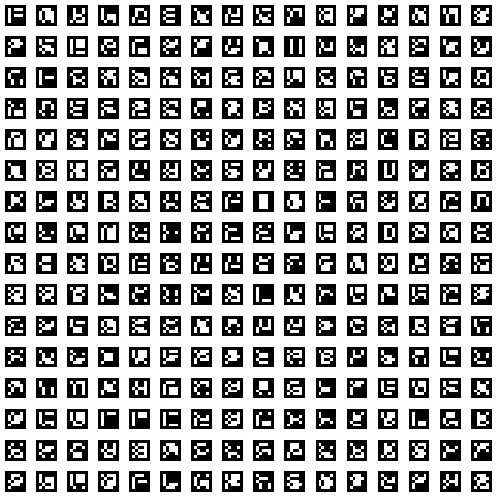
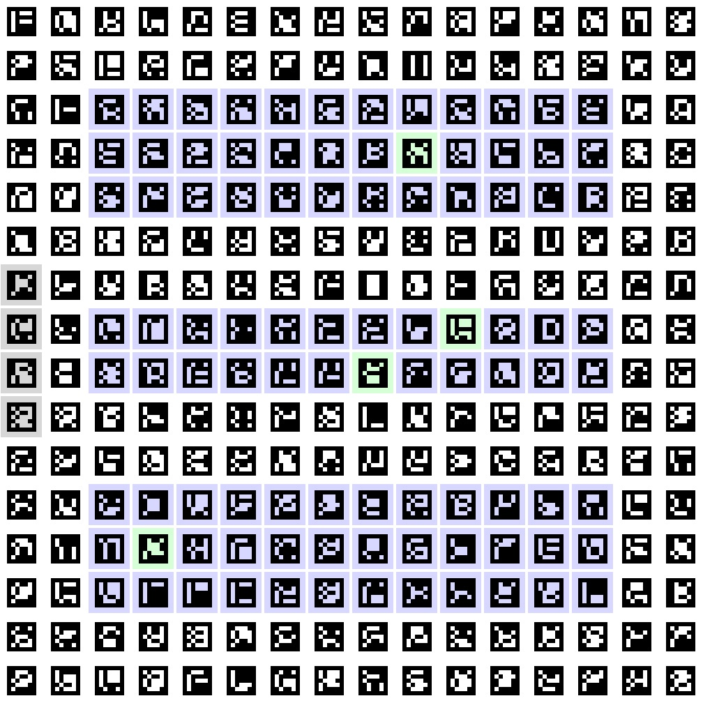

# ArUco-colour-overlay

Detect and create a coloured overlay over ArUco markers

## Requirements

This program was made with `Python 3.10` on a `ubuntu 22.03` system. click on the following links to check installation steps:

[Python installation](https://www.python.org/downloads/)

## Installation

After you have installed python into your system\*, you can clone this repo:

```bash
git clone https://github.com/Xpect8tions/ArUco-colour-overlay
```

> \*: Some programs may not work as intended on other operating systems

note: before starting the program, remember to update the path to your packages in the code before running it.

## How to use

once everything is completed, you can begin by going to where you downloaded the package and first running the [update_yaml_on_collage.py](./opcv/opcv/update_yaml_on_collage.py) file. You should see an image of the generated collage. (example below)

Once the collage image is shown to you and you have decided that you don't need to inspect know every marker id location, you can press **any button** to close it. It should create an image called `collage16.jpg` in your current directory, or where you may have downloaded this package to.
with the newly created image, you can run [change_colours_pic.py](./opcv/opcv/change_colours_pic.py) which will show you the same 'collage16.jpg', but this time with the colour overlay as foretold by the name of the repo. (example below)



same as before, just press any button to close it, and it will save as an image named 'collage16_colourised.jpg' Where the first image is saved.

running either program again will override the previous file.

## Inside the package

The [/markers](./markers/) directory is just a folder full of _ARUCO_ORIGINAL_DICT_ marker pngs (It is the Dictionary I chose to use)

The [/opcv](./opcv/) (short for opencv) directory is where the main files are being held.
within the `/opcv` directory, there are 2 main folders, `/config` and `/opcv`.

### /opcv

[This folder](./opcv/opcv/) contains the main codes that are to be run. [update_yaml_on_collage.py](./opcv/opcv/update_yaml_on_collage.py) is able to generate a 16\*16 collage of ArUco markers (somehow unable to generate larger collages) and will update the yaml config file on the ids, locations and status of the marker. [change_colours_pic.py](./opcv/opcv/change_colours_pic.py) is the main code that I managed to get work. For more details [click here](./opcv/opcv/README.md)

### /config

[This folder](./opcv/config/) contains the main params file which is what the `update_yaml_on_collage.py` file updates and what the `change_colours_pic.py` file reads to figure out how to colour the markers. For more details [click here](./opcv/config/README.md)
