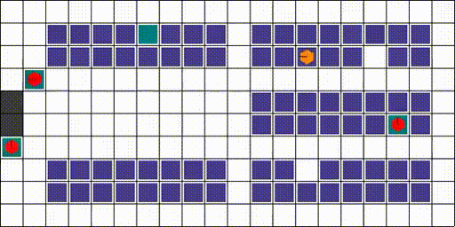

# ids_params.yaml

This is a yaml file that will be updated by [update_yaml_on_collage.py](../opcv/update_yaml_on_collage.py) and is to be read by any file that wishes to view and colour your `collage16.jpg` file.

The dictionaries are saved like this inside of python:

```yaml
{
    <aruco_id> : [<status>,[<x_position>,<y_position>]],
    <aruco_id> : [<status>,[<x_position>,<y_position>]],
    <aruco_id> : [<status>,[<x_position>,<y_position>]],
                .
                .
                .
}
```

when viewed in the yaml:

```yaml
<aruco_id>:
- <status>
- - <x_position>
    - <y_position>
<aruco_id>:
- <status>
- - <x_position>
    - <y_position>
<aruco_id>:
- <status>
- - <x_position>
    - <y_position>
        .
        .
        .
```

The `<status>` valaue is defined as such:
0 = nothing
1 = shelf
2 = target shelf
3 = robot
4 = robot under shelf
5 = robot under target shelf
6 = robot actuator up, lifting nothing
7 = robot actuator up, lifting shelf
8 = robot actuator up, lifting target shelf
-1 = goal
-2 = robot in goal
-3 = with robot lifting something in goal

The status defines the colour of the marker, where it will follow the RWARE colouring, see below for reference:


